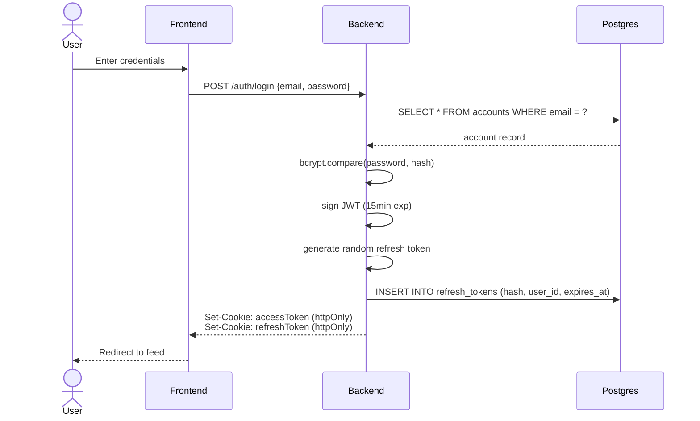
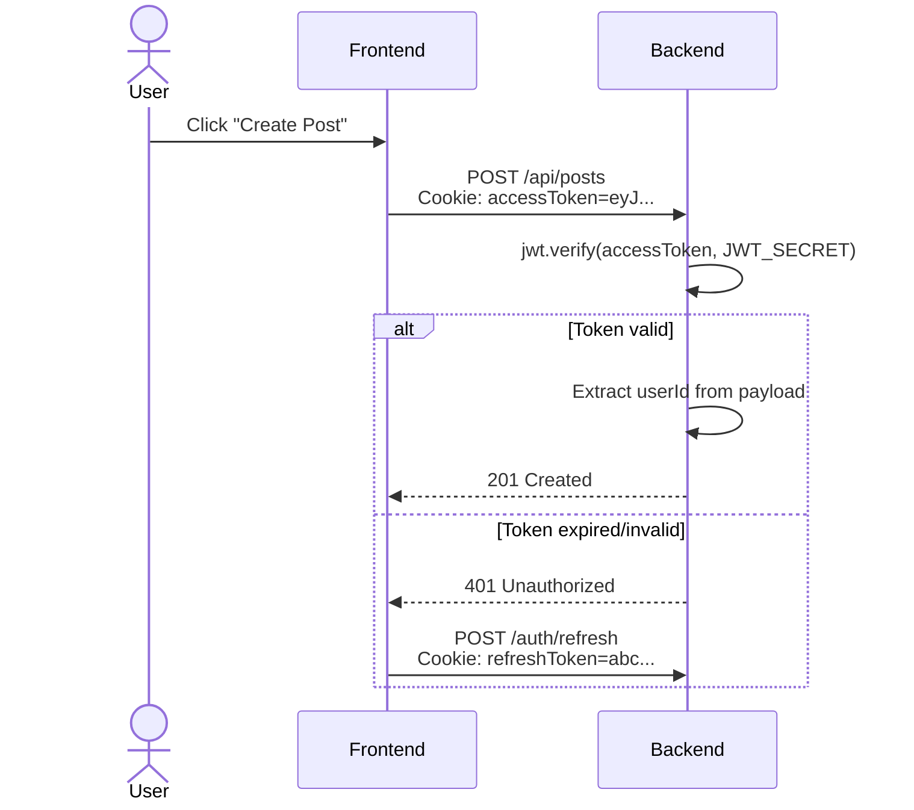
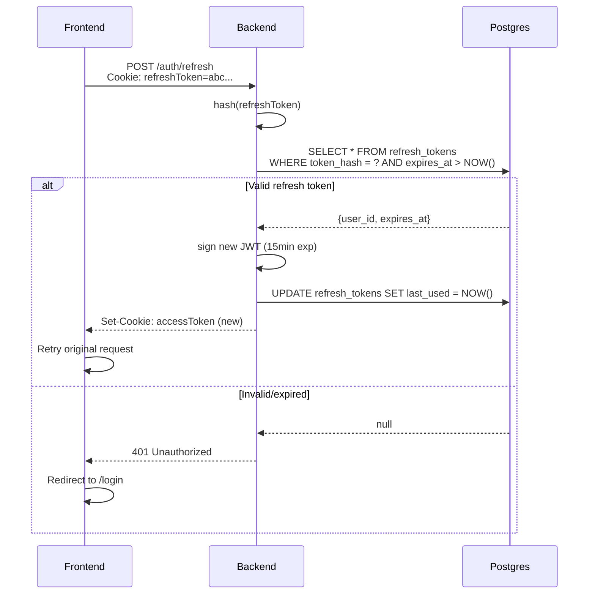

# arch/diagrams/auth-flow.md

# Authentication Flow

## Login & Token Issuance

```mermaid
sequenceDiagram
    actor User
    participant FE as Frontend
    participant BE as Backend
    participant DB as Postgres

    User->>FE: Enter credentials
    FE->>BE: POST /auth/login {email, password}
    BE->>DB: SELECT * FROM accounts WHERE email = ?
    DB-->>BE: account record
    BE->>BE: bcrypt.compare(password, hash)
    BE->>BE: sign JWT (15min exp)
    BE->>BE: generate random refresh token
    BE->>DB: INSERT INTO refresh_tokens (hash, user_id, expires_at)
    BE-->>FE: Set-Cookie: accessToken (httpOnly)<br/>Set-Cookie: refreshToken (httpOnly)
    FE-->>User: Redirect to feed
```

## Authenticated Request

```mermaid
sequenceDiagram
    actor User
    participant FE as Frontend
    participant BE as Backend

    User->>FE: Click "Create Post"
    FE->>BE: POST /api/posts<br/>Cookie: accessToken=eyJ...
    BE->>BE: jwt.verify(accessToken, JWT_SECRET)
    alt Token valid
        BE->>BE: Extract userId from payload
        BE-->>FE: 201 Created
    else Token expired/invalid
        BE-->>FE: 401 Unauthorized
        FE->>BE: POST /auth/refresh<br/>Cookie: refreshToken=abc...
    end
```

## Token Refresh

```mermaid
sequenceDiagram
    participant FE as Frontend
    participant BE as Backend
    participant DB as Postgres

    FE->>BE: POST /auth/refresh<br/>Cookie: refreshToken=abc...
    BE->>BE: hash(refreshToken)
    BE->>DB: SELECT * FROM refresh_tokens<br/>WHERE token_hash = ? AND expires_at > NOW()
    alt Valid refresh token
        DB-->>BE: {user_id, expires_at}
        BE->>BE: sign new JWT (15min exp)
        BE->>DB: UPDATE refresh_tokens SET last_used = NOW()
        BE-->>FE: Set-Cookie: accessToken (new)
        FE->>FE: Retry original request
    else Invalid/expired
        DB-->>BE: null
        BE-->>FE: 401 Unauthorized
        FE->>FE: Redirect to /login
    end
```

**References**: ADR-002 (cookie storage decision)
